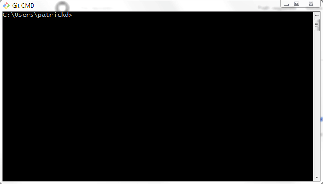

# GIMP-Scripts

This is a repository for useful GIMP scripts for photographers.

With the lockdown of registry.gimp.org, there is no live script repository (until I figure out what to do with the registry). For the time being, we can use this to share and work on helpful photography-related scripts.

* [**sg-luminosity-masks.scm**][sg-luminosity-masks]  
    `<Image> → Filters → Generic → Luminosity Masks (saulgoode)`  
    This is [Saul Goodes][goode] original script based on work that [Pat David][david-lum] had originally done porting [Tony Kuypers Luminosity Masks][kuyper-lum] to GIMP.

* [**patdavid-check-layer.scm**][patdavid-check-layer]  
    `<Image> → Filters → Generic → Skin Check Layer...`  
    This will create a blue-chanel view of the color image to help in identifying and fixing skin blemishes.  
    From an idea by [Calvin Hollywood][], [implementation in GIMP][david-skincheck]. 

[sg-luminosity-masks]: /sg-luminosity-masks.scm
[goode]: http://chiselapp.com/user/saulgoode/repository/script-fu/index
[david-lum]: http://blog.patdavid.net/2013/11/getting-around-in-gimp-luminosity-masks.html
[kuyper-lum]: http://goodlight.us/writing/luminositymasks/luminositymasks-1.html

[patdavid-check-layer]: /patdavid-check-layer.scm
[Calvin Hollywood]: https://www.youtube.com/watch?v=OSP-XTIfnGU
[david-skincheck]: http://blog.patdavid.net/2013/04/getting-around-in-gimp-blue-channel.html 

## Installing GIMP Scripts (Scheme, .scm)

The .scm files need to be placed into the "Scripts" folder of GIMP.

The easiest way to locate these folders (and to possibly add new locations) is to open GIMP, then navigate to:  

`Edit → Preferences`

From there, go to: `Folders → Scripts`

The list of folders that GIMP will search for scripts is shown (two in this example).

The .scm files can either be placed in one of the listed directories or a new directory location can be added for GIMP to look for scripts (a better approach).

### Simple Installation

Using the ability shown above to add arbitrary, new folder locations to look for scripts, it's simple to get _all_ of the scripts in this repository added to GIMP.

1. (If you haven't already) [get git][] and install it.

2. Navigate to a good location to save these files.
    Git will want to clone repositories into a new directory under your current location, so I used my home folder (`C:\Users\patrickd`) here as an example (yours can be anywhere you want).

3. Clone this repository (See 3a below if you don't have git):  
    `C:\Users\patrickd> git clone https://github.com/pixlsus/GIMP-Scripts.git`

      

    You'll now have the repo on your path: `C:\Users\{USERNAME}\GIMP-Scripts\ `

    3a.  You can download the repository contents as a .zip file as well.

    

4. Following the above example of adding a new directory for GIMP to search for scripts, add this new cloned directory.

Voilà!

To update all of the scripts quickly and easily, simply navigate back into the directory and run `git pull`.  This will download the latest versions of all the scripts for you.

[get GIT]: https://git-scm.com/downloads
